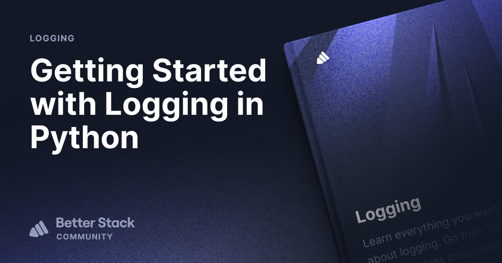

# Logging in Python Code Snippets

This repository contains code snippets for the Better Stack tutorial on the
Python Logging module.

**Tutorial**: [How to Get Started with Logging in Python](https://betterstack.com/community/guides/logging/how-to-start-logging-with-python/).



## 🟢 Prerequisites

You must have Python installed on your machine. The code snippets in this repository
were tested against Python v3.10.

## 📦 Getting started

- Clone this repo to your machine:

```shell
git clone https://github.com/betterstack-community/python-logging
```

- `cd` into the project folder.

```shell
cd python-logging
```

- Follow through with the [linked tutorial](https://betterstack.com/community/guides/logging/how-to-start-logging-with-python/).

## ⚖ License

The code used in this project and in the linked tutorial are licensed under the
[Apache License, Version 2.0](LICENSE).
